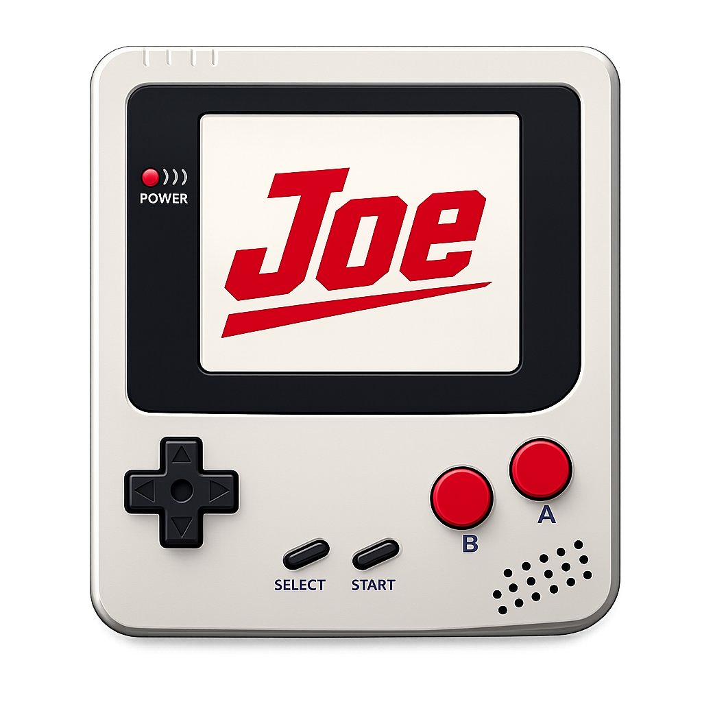
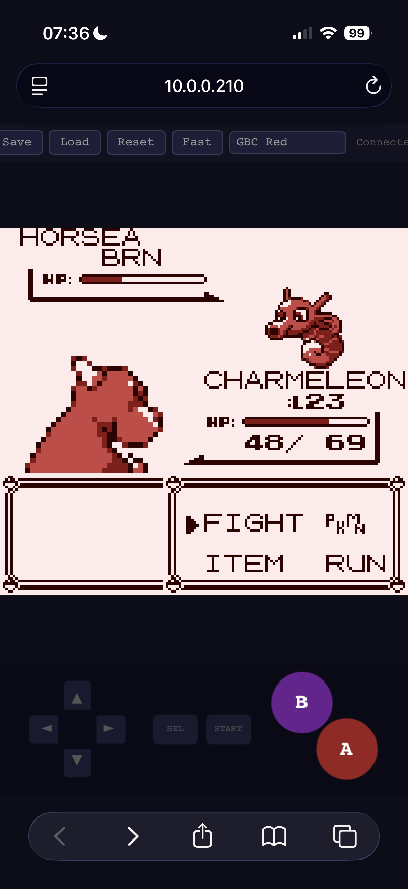

# Joe's Gameboy

A Game Boy DMG emulator written in C

I started this project in 2021 and got as far as getting TETRIS playable, then I left the project for a while. Starting in 2026, I've been guiding Claude Sonnet 4.6 to gradually complete the emulator and add many more features.

### Features

- Multiple UIs - SDL/WASM/headless/native macOS
- A headless server mode that allows `screen -x` or `tmux attach` functionality, for gaming on the Go.
- Game saves/snapshots
- Toggleable Color Palettes
- Toggleable Fast Mode (4x) to make grinding Pokemon easier
- Correctness: Blargg/Mooneye e2e tests pass.

### Upcoming features

- Gameboy Color
- Audio
- Auto builds/releases using GHA

### Screenshots


Pokemon red with red palette on iphone/websockets




Pokemon red with blue palette on safari/websockets (same game streamed)


Donkey Kong Land with gold palette in SDL


Pokemon red with stock palette in SDL


## Frontends

| Frontend | Description |
|---|---|
| **SDL** | Native desktop window (default) |
| **macOS** | Native macOS app (`Joe's Gameboy.app`) with full AppKit UI |
| **Server** | Headless + WebSocket; stream gameplay to a browser |
| **WASM** | Runs entirely in the browser via WebAssembly |

All frontends share the same emulator core (`gb.c`) and save-state format.

## Dependencies

### Linux (apt — Debian/Ubuntu)
```bash
sudo apt-get install gcc libsdl2-dev libcbor-dev libwebsockets-dev
# WASM only:
sudo apt-get install emscripten
```

### Linux (dnf — RHEL / AlmaLinux 10)

For the WebSocket/headless server (`gb-server`), libcbor is bundled at
build time — no system package needed.  Only `gcc` and `libwebsockets-devel`
are required:

```bash
sudo dnf install epel-release
sudo dnf install gcc libwebsockets-devel
make gb-server
```

For the full SDL desktop build, AlmaLinux 10 ships SDL3 and does not
package `SDL2-devel` or `libcbor-devel`, so those still require manual steps:

```bash
# Enable EPEL and CRB repos
sudo dnf install epel-release
sudo dnf config-manager --enable crb

# Packaged deps
sudo dnf install gcc SDL3-devel libwebsockets-devel

# sdl2-compat: SDL2 API on top of SDL3 (headers + runtime)
sudo dnf install sdl2-compat
git clone https://github.com/libsdl-org/sdl2-compat.git
cd sdl2-compat && cmake -B build && cmake --build build && sudo cmake --install build
cd ..

# WASM only (emscripten not in any EL10 repo — install via emsdk):
git clone https://github.com/emscripten-core/emsdk.git
cd emsdk && ./emsdk install latest && ./emsdk activate latest
source ./emsdk_env.sh
```

### macOS (brew)
```bash
brew install sdl2 libcbor libwebsockets
# WASM only:
brew install emscripten
```

> **macOS app (`make mac`)** — libcbor is compiled from source at build time and
> statically linked. Only `xcrun clang` (Xcode Command Line Tools) is required;
> no Homebrew packages are needed for that target.

## Building

### SDL (desktop)
```bash
make
./gb game.gb
```

Controls:

- Arrow keys = D-Pad
- `A` = A
- `S` = B
- `Enter` = Start
- `Shift` = Select
- `F5` = Save state
- `F6` / `shift + F6` = Change color palette
- `F` = Toggle fast mode (~4× speed).

### macOS app

Builds a self-contained `Joe's Gameboy.app` bundle — no dynamic dependencies
beyond system frameworks.

```bash
make mac
open "build/Release/Joe's Gameboy.app"
```

The first build downloads and compiles libcbor from source automatically.
Subsequent builds are incremental (libcbor is cached in `deps/`).

**Features:**
- Native menu bar: File, Emulation, View, Palette, Window
- `⌘O` Open ROM, `⌘S`/`⌘L` Save/Load State, `⌘R` Reset
- `⌘P` Pause / Resume, `⌘F` Fast Forward (4×)
- `⌃⌘F` Full screen (also via the green title-bar button)
- **Open Recent** — last 10 ROMs, most-recently-loaded first
- Auto-saves state when switching ROMs or closing the window
- Auto-restores state when re-opening a previously played ROM
- Drag a `.gb` / `.gbc` file onto the window to swap games
- Palette menu mirrors all palettes available in the SDL frontend
- Remembers last ROM and palette across launches

**Controls:**

| Key | Action |
|---|---|
| Arrow keys | D-Pad |
| `A` | A button |
| `S` | B button |
| `Return` | Start |
| `Shift` | Select |

### Server (browser remote)
```bash
make
./gb --server game.gb           # listens on :8080
./gb --server --port 9000 --bind 127.0.0.1 game.gb
```

Open `http://localhost:8080` in a browser. The page streams the framebuffer over
WebSocket. Save states are stored server-side adjacent to the ROM.

### WASM (local browser)
```bash
make wasm-deps   # download and compile libcbor with emcc (one-time)
make wasm        # produces dist/gb.js + dist/gb.wasm

cp frontend/index.html dist/
cd dist && python3 -m http.server 8000
```

Open `http://localhost:8000/?wasm=1`, click **Load ROM**, pick a `.gb` file.
Save/load state downloads and uploads `.cbor` files locally.

## Headless / testing
```bash
# Blargg serial output:
./gb --headless --cycles 100000000 rom.gb

# Cycle-limited with pass/fail register:
./gb --headless --gbmicrotest --cycles 500000 rom.gb
```

## Save states

Save states use CBOR and are compatible across all frontends.

| Frontend | Save | Load |
|---|---|---|
| SDL | `F5` | auto-loaded on next launch |
| macOS | `⌘S` or auto-saved on close/ROM switch | `⌘L` or auto-restored on open |
| Server | toolbar button / `F5` key in browser | toolbar button |
| WASM | downloads `.cbor` file | uploads `.cbor` file |

Battery-backed cartridge RAM (`.sav`) is loaded and saved automatically.

## Options

```
./gb [options] <rom.gb | save.cbor>

  --headless          Run without display
  --server            Start WebSocket server (implies --headless)
  --port <n>          WebSocket server port (default: 8080)
  --bind <addr>       Bind address (default: all interfaces)
  --cycles <n>        Stop after n cycles
  --model <name>      Hardware model: dmg (default), dmg0, mgb, sgb, sgb2, cgb
  --gbmicrotest       Read 0xFF82 pass/fail after cycle limit
  --ppm <file>        Dump current frame to PPM file
```
